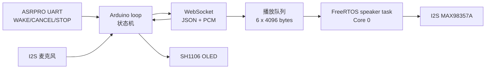
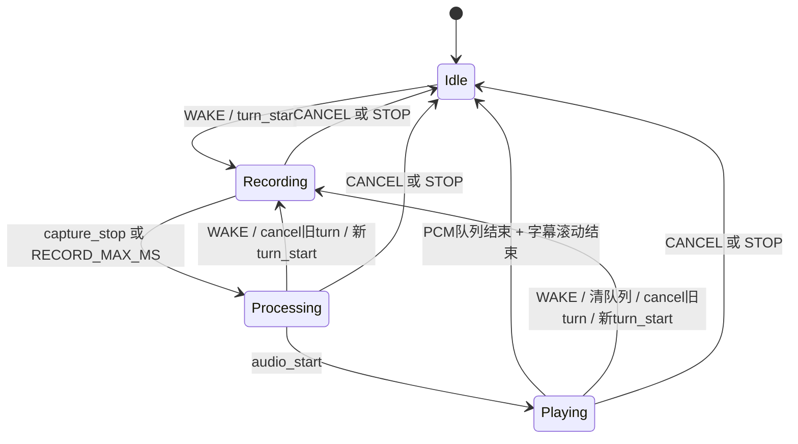

# 阶段四固件：实时协议、异步播放与语音打断

版本：`v4.0.0-realtime-foundation`，云端协议：`400`。

本阶段解决固件里影响实时对话的两个核心问题：第一，播放 PCM 不再阻塞 WebSocket 回调；第二，每轮消息都有 `turn_id`，播放/处理中再次唤醒可以取消旧轮并立即开始新轮。

> 这仍是半双工加 barge-in。扬声器播放时不会同时持续上传麦克风，所以不要求当前硬件立即实现 AEC。真全双工必须先解决声学回声消除和麦克风/扬声器串扰。

## 1. 已实现能力

- 连接云端后发送 v4 `hello`，记录服务端协议与版本。
- 使用 `turn_start` / `turn_end` 替代旧的 `start_record` / `finish_record`。
- 每轮递增 `turn_id`，固件忽略带旧 turn ID 的延迟消息。
- 支持 `asr_partial` 实时字幕、`asr_final` 最终识别文本。
- 支持云端 `capture_stop`，由 Qwen server VAD 控制录音结束。
- I2S 扬声器写入放到独立 FreeRTOS 任务；WebSocket 回调只复制数据到有界队列。
- `audio_end` 作为队列结束标记，确保排队的 PCM 播完后再结束播放状态。
- 处理/播放中再次收到 ASRPRO `WAKE` 时发送 `cancel(reason=barge_in)`，清空播放队列并开始新一轮录音。
- 移除未生效的 `RECORD_MIN_MS`、`AnswerIntro`、`AnswerDone` 和旧通用 JSON 包装函数。

## 2. 运行结构



主循环负责 Wi-Fi、WebSocket、ASRPRO、麦克风和 OLED；扬声器任务只负责按队列写 I2S。这样云端音频播放不会让 WebSocket 心跳、取消消息和新的唤醒长时间得不到处理。

## 3. 硬件接线

保持现有 `include/pins.h`：

| 模块 | 信号 | ESP32-S3 | 注意事项 |
| --- | --- | --- | --- |
| SH1106 OLED | SDA/SCL | GPIO8/GPIO9 | 软件 I2C，地址 0x3C |
| I2S 麦克风 | SCK/WS/SD | GPIO4/GPIO5/GPIO6 | 16 kHz 单声道 |
| ASRPRO | TX -> ESP RX | GPIO16 | 若为 5V 电平必须转换 |
| ASRPRO | RX <- ESP TX | GPIO17 | 当前可选 |
| MAX98357A | BCLK/LRC/DIN | GPIO12/GPIO13/GPIO14 | 扬声器接 SPK+/SPK- |
| MAX98357A | SD | GPIO15 | 固件拉高 |

所有模块必须共地。MAX98357A 建议从稳定的 5V/VBUS 供电，麦克风和 ESP32 使用 3.3V 逻辑。

## 4. 配置步骤

```bash
git clone https://github.com/nvnmvm/esp32-s3-AIchat-firmware.git
cd esp32-s3-AIchat-firmware
bash scripts/init-config.sh
```

编辑 `include/config.h`：

```cpp
#define WIFI_SSID "你的WiFi"
#define WIFI_PASSWORD "你的密码"

#define WS_HOST "voice.example.com"
#define WS_PORT 443
#define WS_PATH "/ws"
#define WS_USE_SSL true
#define WS_TOKEN "与VPS .env 相同的长随机token"

#define DEVICE_ID "esp32-s3-voice-001"
#define AUDIO_SAMPLE_RATE 16000
#define AUDIO_CHUNK_MS 40
#define RECORD_MAX_MS 12000
#define CLOUD_PROTOCOL_VERSION 400
```

麦克风无声或很小时再调整：

```cpp
#define MIC_CHANNEL_LEFT true
#define MIC_GAIN_SHIFT 0
#define MIC_INVERT_SIGNAL false
```

每次只改一个参数。先根据云端 `audio_report.json` 看 `rms`、`peak`、`clipped`，不要在不知道原始幅度时直接加大增益。

## 5. 构建、烧录和串口监视

安装 PlatformIO Core 后执行：

```bash
pio run
pio run -t upload
pio device monitor -b 115200
```

也可以：

```bash
bash scripts/flash.sh
```

编译成功时，默认 N8 无 PSRAM 开发板的 RAM 使用应明显低于 80%。播放队列固定占用约 25 KiB，加上 I2S DMA 后仍应留出足够的 Wi-Fi/TLS 堆空间。

## 6. 协议时序

### 6.1 握手

WebSocket 连接后固件发送：

```json
{"type":"hello","protocol":400,"firmware":"v4.0.0-realtime-foundation","device_id":"esp32-s3-voice-001"}
```

串口应出现：

```text
Cloud handshake protocol=400 version=v4.0.0-realtime-foundation
```

### 6.2 开始录音

ASRPRO 输出 `WAKE\n` 后：

```json
{"type":"turn_start","turn_id":1,"protocol":400,"audio":{"format":"pcm_s16le","sample_rate":16000,"channels":1,"chunk_ms":40},"device":{"id":"esp32-s3-voice-001","mic_channel":"left","firmware":"v4.0.0-realtime-foundation"}}
```

固件随后每 40 ms 发送约 1280 字节 PCM。云端的 `turn_ready.realtime_asr=true` 表示本轮已接入 Qwen 实时 ASR；`false` 表示云端会使用批量识别回退。

### 6.3 服务端 VAD 和字幕

收到：

```json
{"type":"asr_partial","turn_id":1,"text":"今天天气"}
```

OLED 使用“识别结果”页更新字幕。收到：

```json
{"type":"capture_stop","turn_id":1,"reason":"server_vad"}
```

固件停止上传并发送：

```json
{"type":"turn_end","turn_id":1,"protocol":400,"reason":"server_vad"}
```

如果云端实时 ASR 未配置，固件仍会在 `RECORD_MAX_MS` 到达时主动结束，云端也保留自己的本地 VAD。

### 6.4 音频播放

云端先发 `audio_start`，再发送 PCM 二进制帧，最后发 `audio_end`。固件回调只入队；扬声器任务从队列取出并调用 `i2s_write`。结束标记排在所有 PCM 后面，因此不会出现收到 `audio_end` 就提前清空尾音的问题。

播放队列容量有限，云端 v4 默认按 `TTS_PCM_CHUNK_MS=80` 实时节奏发送。若接入其他云端实现，不要把十几秒 PCM 瞬间全部推给设备。

### 6.5 打断播放

在 `Processing` 或 `Playing` 状态再次说唤醒词：

1. 固件发送当前 turn 的 `cancel`。
2. `playbackGeneration` 递增，旧队列项即使被取出也会被丢弃。
3. 清空 I2S DMA 和播放队列。
4. turn ID 递增并发送新的 `turn_start`。

这条路径没有 500 ms 的提示等待。正常 `CANCEL` 仍会短暂显示“已取消”。

## 7. 状态机



## 8. 验收步骤

### 8.1 基础链路

1. 上电后 OLED 显示等待唤醒，串口显示 Wi-Fi 和 WebSocket 已连接。
2. 串口确认云端协议为 400。
3. 说唤醒词，确认串口持续打印 `Sent PCM chunk`。
4. OLED 在讲话过程中显示变化的局部识别文本。
5. 停顿后约 400 ms，串口出现 `Finish recording: server_vad`。
6. 回答音频完整播放，串口最终出现 `Playback queue drained`。

### 8.2 打断测试

1. 让 AI 回答一段至少 5 秒的文本。
2. 播放约 1 秒后再次说唤醒词。
3. 旧音频应快速停止，OLED 转回听取中。
4. 串口出现 `Barge-in`，下一轮 turn ID 比上一轮大 1。
5. 若旧轮延迟消息到达，串口应打印 `Ignored stale cloud event`，屏幕不能被旧回答覆盖。

### 8.3 故障测试

- 断开 VPS：设备回到重连状态，不能卡死在播放。
- Qwen 配置错误：固件收到 `turn_ready.realtime_asr=false`，仍应完成批量识别。
- 快速连续 `CANCEL`：不能崩溃，播放队列应保持为空。
- 超长回答：不能出现 `Playback queue full`；出现时先检查云端是否按实时节奏发送。

## 9. 当前限制和下一步

- 代码仍集中在 `src/main.cpp`。下阶段建议拆为 `protocol.*`、`audio_capture.*`、`audio_playback.*`、`display.*` 和 `session.*`，每次拆一个模块并保持可编译。
- 音频仍为未压缩 PCM，40 ms 上行约 256 kbit/s（不含 WebSocket 开销）。弱网优化可评估 Opus，但应先完成稳定性数据。
- OLED 字幕没有变化率限制，极高频局部结果可增加 80~120 ms 去抖。
- 当前没有 AEC、AGC 和神经降噪，不支持真正的扬声器播放期间持续收音。
- WSS 当前依赖 WebSocketsClient 默认 TLS 行为。生产设备应加入 CA/证书校验和设备独立 token。
